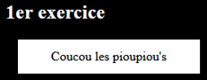
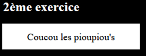
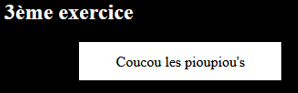

# Apprentissage des animations

Durant ce projet solo, le but est de comprendre comment réaliser des animations via SASS. 

Pour cet exercice, la syntaxe SCSS a été utilisée. 

A partir d'un bouton de base, l'accent a été mis sur : 

- Le changement de couleur de celui-ci au moyen de la pseudo-classe `:hover`

- Le changement de taille de celui-ci au moyen de la pseudo-classe `:hover`

- Le changement de place de celui-ci au moyen de la pseudo-classe `:hover`

[Animations](https://calcagnoloic.github.io/learning-animation/)
